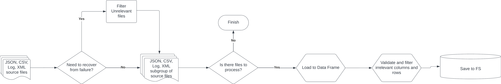

# NVIDIA Home assignment
# Overview
This system is designed to parse input files from a specified directory, <br>
validate (parameter - type & size & name) ,process and subsequently store (uniquness data) in both a JSON formatted file in the file system and a structured SQLite database.

# Task 1: Data Parsing and Formatting - Extractor service
1. **Data Loading** - Load all the files in `input_files` folder into a pandas DataFrame, facilitating easy validation and preparation across different data sources. For larger datasets, the loading process can be batched to manage memory efficiently.
2. **Data Validation and Processing** - Validate the data type and size according to predefined schema at `config/schema.yaml`. (Any discrepancies or issues are logged in a `corrupted_files.log`.)
3. **Output Generation** - Processed data is saved into a JSON format under the `formatted_files` directory for further use or archival purposes.

### Assumptions:
1. Header uniqueness - every header or supported header is exists only once (for example it not possible that test_result will have header that map to it, and test_description have this header too)
2. Log parser - we assume the pattern of logs is | key:value | when "|" is seperate between parameters

### Tests
Created 3 static tests and 1 dynamic
1. check the example which provided
2. check the failure recovery
3. Dynamic test - creating files dynamiclly based on the schema files,  and other parameter (min/max rows in file and number of file). <br>
                  for every invalid row (size, type, or  not exists) we will count it and for every file we generate failure counter file. <br>
                  the test support in xml, csv, json.
4. check the validation of row without "mandatory" column (it will be remove and write to log)
                  



## Recovery from failures
The task have the ability to recover from failures by easy process.

1. **File Processing Order** - Files are processed based on their **modification** dates to maintain a logical order.
2. **Checkpointing** - After processing each batch of input files, a checkpoint (output) file named `partition_{last file timestamp}.json` is generated, marking the timestamp of the latest input file which processed.
3. **Resuming Operations** - In case of a failure, the system identifies the latest checkpoint and resumes processing with the next file, using the timestamp from the checkpoint file as a reference.

### Example - Recover from failure
Lets think we have 3 files in **input_files** directory, which modified (in the file system) at times 13,14,15, we will run the task and it failed between DataFrame 2 to 3 after creation output files for partition_13.json. partitio_14.json


Now when we run it again our task go to the input files and look for latest output file (input_14.json), than by its name, it will look on the input files and filter all the filenames which is modified before time 14.


## Task 2: Data Storage in SQLite  - Loader service


1. **Data Loading**: Use pandas to load multiple JSON formatted output files from Task 1.
2. **Database Insertion**:
     - **Headers Table**: Stores unique header information with a UUID5 as the primary key. this key created by string which contains the value of all the mandatory columns (without **source_file** and **source_type**)
     - **Dynamic Data Table**: Stores attribute data associated with each header. This table has a foreign key linked to the Headers Table's UUID, enabling a one-to-many relationship from headers to attributes.
3. **Pandas Integration**: Utilize pandas' capabilities for efficient data manipulation and insertion into the SQLite database.


## How to Run?

To facilitate usage, a Docker Compose file has been provided. Follow these steps:

1. **Install Docker Compose**: Ensure Docker Compose is installed on your system.
2. **Launch the Application**: Run the following command:
   
    ```
    docker-compose build
    docker-compose up [SERVICE_NAME]                     ## SERVICE_NAME = [extractor-service, loader-service]
    ```

The outputs will be available at the following locations:

- `formated_files`: Contains JSON-formatted files.
- `loader/db`: Contains the SQLite local database file.
- `SERVICE_NAME/log`: Contains the log of the service.
