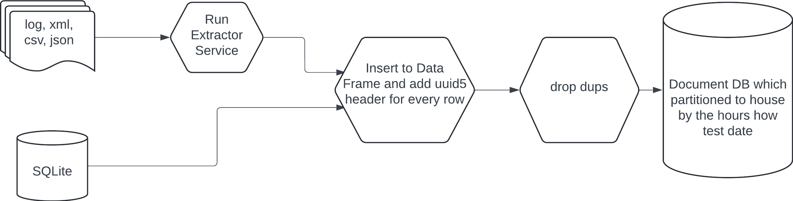

Overview

The objective of this project is to establish a centralized data lake that serves as a unified repository for raw data accessible to various teams within the organization.  
This data lake will ensure that all data stored is unique, validated, and readily usable for consumption

# Design Components
## Data Preparation
FS: Use the Data Processing service to prepare the data and store it in the FS. 
SQLite: The data order in the format we expected

## Data Integration and Publishing
### Apache Kafka Integration: 
Develop a process that ingests data from both the filesystem and SQLite. 
To avoid duplicate data entries in Kafka, generate a UUID5 for each record based on mandatory columns (without source_type and source_file because we want to avoid duplicates of different event in different files) . 
This UUID5 will serve as a unique key to identify and deduplicate records.

## Data Storage and Partitioning
### Document Database: 
Establish a routine that runs hourly, transferring new messages from Kafka to the appropriate hourly partitions in the document database.  
Organize this data into partitions divided by hour. (The test hour)

## Monitoring and Error Handling
Set up monitoring for the filesystem ingestion process to capture and address any issues related to data formatting or schema mismatches with SQLite. 
Implement additional monitoring to identify and resolve issues related to data typing or schema inconsistencies across the data sources. 
Ensure that data is available in the document database with a maximum latency of one hour (+1 hour).